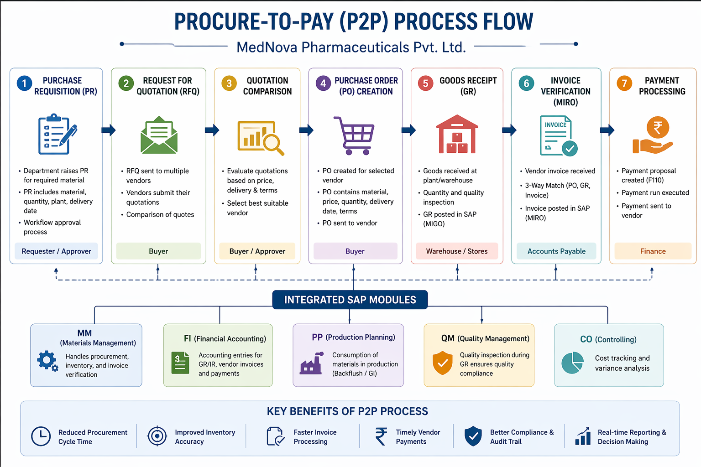

# SAP Procure-to-Pay (P2P) Process Implementation  
### MedNova Pharmaceuticals Pvt. Ltd.

## 📌 Project Overview
This project demonstrates the implementation of the **Procure-to-Pay (P2P) process** using **SAP ERP (MM Module)** for a fictional pharmaceutical company — *MedNova Pharmaceuticals Pvt. Ltd.*

The implementation covers the complete procurement lifecycle from **Purchase Requisition to Vendor Payment**, ensuring automation, compliance, and real-time integration with finance and production systems. :contentReference[oaicite:0]{index=0}

---

## 🏢 Company Context
- **Company:** MedNova Pharmaceuticals Pvt. Ltd. (Fictional)
- **Industry:** Pharmaceutical Manufacturing & Distribution  
- **Headquarters:** Hyderabad, India  
- **Plants:** Hyderabad, Pune, Ahmedabad  
- **ERP Module Used:** SAP MM (Materials Management)

---

## 🚨 Problem Statement
Before SAP implementation, the company faced:

- Manual procurement and delayed approvals (5–7 days)  
- No centralized vendor database (duplicate vendors)  
- Inventory inaccuracies (~78% accuracy)  
- Invoice delays (45–60 days processing time)  
- Lack of audit trail (GMP compliance issues)  
- No real-time reporting  

These inefficiencies impacted operations, compliance, and decision-making. :contentReference[oaicite:1]{index=1}

---

## ✅ Solution Implemented

The SAP MM module was configured to automate the entire P2P cycle:

### 🔄 End-to-End Flow

### ⚙️ Key Features
- Automated procurement workflow  
- Centralized Vendor & Material Master  
- 3-Way Matching (PO-GR-Invoice)  
- Real-time inventory tracking  
- SAP MM ↔ FI integration  
- GST & GMP compliance  
- Automated vendor payments (F110)

---

## 📊 Project Deliverables

This repository includes:

- 📄 **Project Report (DOCX/PDF)**  
- 📄 **Project Documentation (Formatted PDF)**  
- 🖼️ **P2P Process Flow Diagram (Image)**  
- 📁 Supporting files and descriptions  

---

## 🧠 Tech Stack

| Layer | Technology |
|------|-----------|
| ERP System | SAP ERP / SAP S/4HANA |
| Module | SAP MM (Materials Management) |
| Integration | SAP FI (Financial Accounting), SAP PP |
| Tools | SAP GUI, SPRO, LSMW, BAPI |
| Database | SAP HANA |

---

## ⭐ Unique Points

- Pharma-specific batch management & quality inspection  
- Centralized procurement for multi-plant operations  
- GST-compliant invoice processing (India)  
- 3-level PO approval workflow  
- MRP-driven automated procurement  
- Real-time MM–FI integration  

---

## 📈 Results & Improvements

| Metric | Before SAP | After SAP |
|-------|------------|----------|
| Procurement Time | 15 days | 5 days |
| Invoice Processing | 45–60 days | 8–10 days |
| Stock Accuracy | ~78% | >99% |
| Vendor Disputes | High | Minimal |

---

## 🔮 Future Enhancements

- SAP Ariba integration (supplier network)  
- AI-based procurement analytics  
- Vendor self-service portal  
- Blockchain for batch traceability  
- SAP Fiori mobile approvals  
- Automated vendor scorecards  

---

## 🖼️ P2P Process Flow

---

## 🎓 Academic Details
- **Student:** Vishalakshya Tiwari  
- **University:** KIIT University, Bhubaneswar  
- **Module:** SAP BTP  
- **Academic Year:** 2025–2026  

---

## 📚 References
- SAP Help Portal – Materials Management  
- SAP Best Practices Explorer  
- GST & Schedule M Compliance Guidelines  
- SAP MM Configuration Guides  

---

## 🚀 How to Use This Repo

1. Clone the repository  
2. View the documentation files  
3. Refer to the process flow diagram  
4. Use for academic learning / SAP understanding  

---

## 📌 Note
This is an **academic project** created for learning purposes.  
All company data used is fictional.

---

⭐ If you found this helpful, consider starring the repo!
